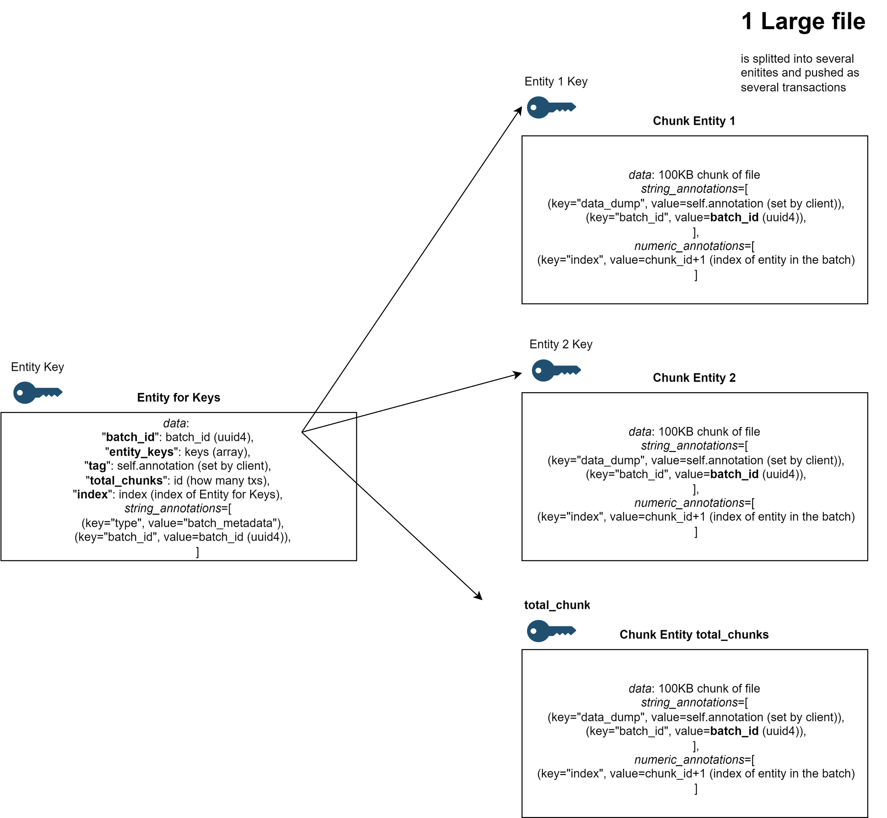

# DAO GolemDB Manager

A decentralized interface for uploading, searching, and downloading files using GolemDB - a blockchain-based decentralized database.

The main idea is to allow users to store very large files on golemDB. The main obstacle to that is the gas limit of single transaction. Currently on hackathon’s testnet we are allowed to push around 120KB of data per transaction. Therefore, our backend would split the file given by the user into many chunks, 100KB each. Every such chunk would be then sent in entity in a separate transaction. To aggregate those scattered across transactions entities, we gave them all the same annotations with unique uuid4 batch_id and string annotation set by user.  Also every chunk has index numeric annotation which indicates the order of how chunks were pushed to blockchain.

After pushing all chunks of file data to golemDB our backend then creates one or more additional entities (entity_for_keys) that will be used for automatic aggregation of all chunk entities. entity_for_keys in data segment contains an array with keys for every chunk entity pushed as the part of the file. This is also important for integrity / security reasons as only entity key is truly unique on blockchain. If key arrays is bigger than tx limit of data, we create more enity_for_keys and index them to know the correct order of keys. On the receiving end, we query for annotation “type” with value of “batch_metadata” and appropriate batch_id annotation. Thanks to that we get all relevant entity_for_keys which we then use to extract and sort keys of chunk entities. This allows us to correctly download a large file from golemDB.



## Demo

https://youtu.be/sHByE_w_ahE

## Team Members

- Marcin Jędral
- Aleksander Wiącek

## Quick Start

### Prerequisites
- Python 3.8+
- Node.js 16+
- MetaMask browser extension

### 1. Backend Setup

```bash
# Install Python dependencies
cd backend
pip install -r requirements.txt

# Start the API server
python app.py
```

Backend will run on `http://localhost:8000`

### 2. Frontend Setup

```bash
# Install Node.js dependencies
cd frontend
npm install

# Start the development server
npm start
```

Frontend will run on `http://localhost:3000`

### 3. Configuration (Optional)

The system works with default settings. To customize:

```bash
# Copy and edit environment files
cp .env-example .env
cd frontend && cp .env.example .env
```

## Features

- **File Upload**: Drag & drop files with TTL control (5 min - 7 days)
- **Search**: Find files by annotations or metadata
- **Download**: Retrieve files directly from search results
- **MetaMask Integration**: Automatic network switching to ETH Warsaw Holesky
- **Expiration Tracking**: Visual indicators for file expiration status

## Usage

1. Open the app at `http://localhost:3000`
2. Connect MetaMask (auto-switches to ETH Warsaw Holesky)
3. Upload files with drag & drop, choose expiration time
4. Search files using the Search tab
5. Download files with the Download button in search results

## Network Configuration

- **Network**: ETH Warsaw Holesky
- **Chain ID**: 60138453033
- **RPC URL**: https://ethwarsaw.holesky.golemdb.io/rpc

MetaMask will automatically add this network when you connect.

## API Documentation

Full API docs available at: `http://localhost:8000/docs`

## Troubleshooting

**Backend won't start?**
```bash
cd backend
pip install -r requirements.txt
python app.py
```

**Frontend won't start?**
```bash
cd frontend
npm install
npm start
```
## Wallet addresses

- 0x6119Cb84698758Bbb9fe9257bF95Ecd7eA8AdF1b
- 0xEc2e9d7f437f4938f70418A35F97d7fa2ED8a16A

## License

This project is licensed under the GNU General Public License v3.0 (GPLv3) - see the [LICENSE](LICENSE) file for details.

For more information about GPLv3, visit: https://www.gnu.org/licenses/gpl-3.0.html
